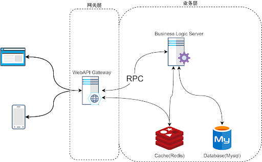
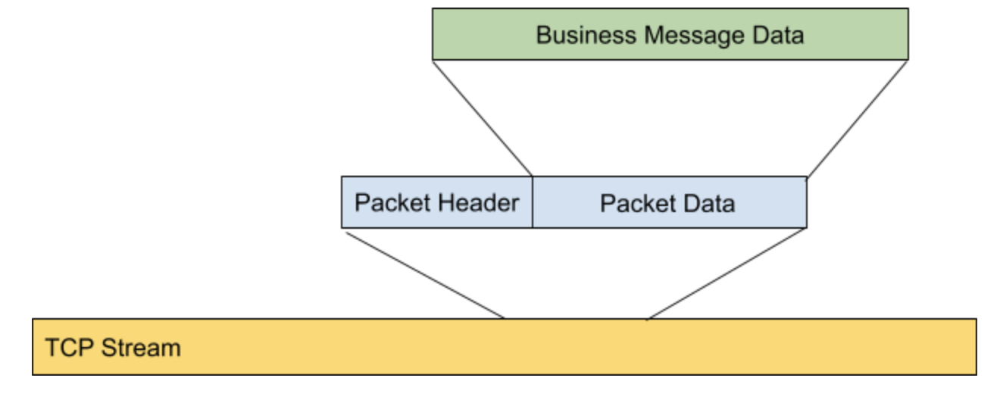
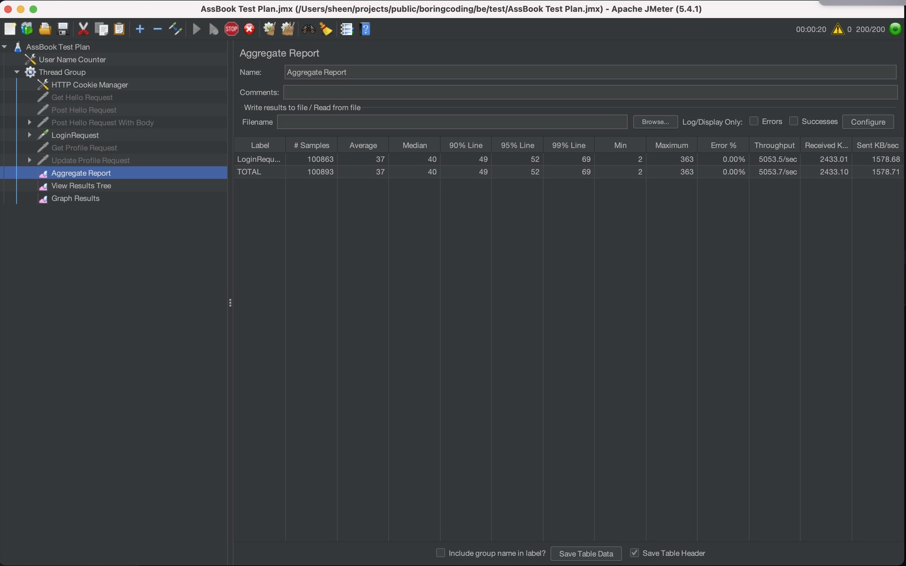
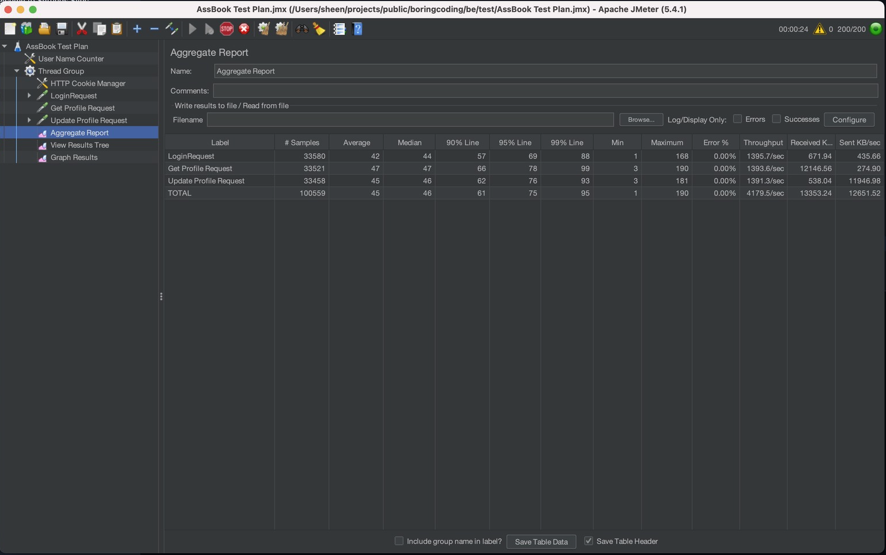

# Boring Coding

## BE:
- gate_server: a WebApi gateway server written with Golang (net/http, source code of the router is from httprouter)
- user_server: a business server for accessing database written with Golang

### System Overview

### RPC Protocol Design

## FE:
- assbook: a simple frontend application based on vue

## Load Test

Single API load test

All API load test

